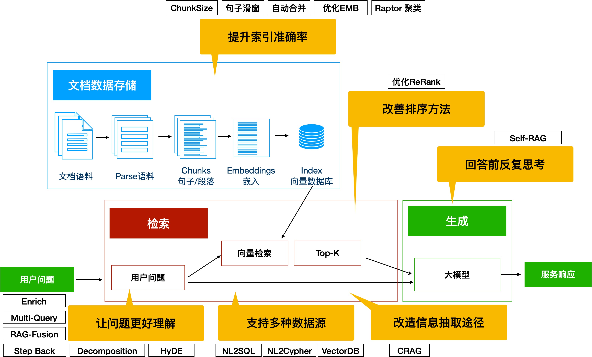

# 智能微博写手

## 学习如何使用 Github 写作完成项目
在开始与其他同学使用 Github 协同工作之前，请确保熟练使用 Github 的协同编程。如果不了解，请先学习[该笔记](./cowork-with-github.md)。

## 项目节点
0. 确定小组 Leader，Leader 负责推进项目进度、把控项目方向（项目开发总周期两个月）。
1. 确定智能微博写手（明确智能微博写手的实用范围，比如基于主题、关键字，自动写作微博某种范例风格/人的风格的博文）
2. 收集数据(1周)，[参考开源数据地址](https://github.com/CLUEbenchmark/CLUEDatasetSearch)
   - 开源数据
   - 私有数据
   - 爬虫数据
   - 其他数据
3. 确定技术路线并开发，是基于 RAG 还是基于模型或其他方案（2周）
   - 基于 RAG，采取检索方案，让大模型来抽取风格、知识等要素，生成相应的博文
   - 基于模型，通过微调大模型，让大大模型学习博文风格，生成博文
   - 基于大模型训练（分析是否需要大模型训练，为什么使用，为什么不用；）
   - 混合方案
   - ...
4. 用户体验增强，增加交互逻辑，生成用户期望的博文（1周）
6. 制作博文写手测试样本（1周）
7. 测试并优化（2周）
   - 提示词优化
   - 基于 RAG 的优化
   - 基于 Agent 的优化
   - 基于模型的微调（语气、知识、风格等）
   - 大模型训练优化
8. 基于 gradio 或其他 UI 制作前端对话页面（1周）
9. 写总结文档，反思项目中的困难、解决方法、学习到什么（1周）
   

